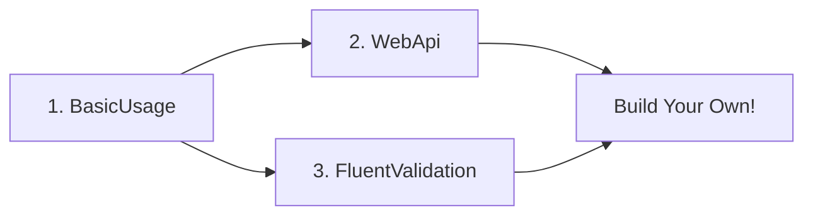

# 🎯 Getting Started with ResultFlow Samples

## What You'll Learn

These samples demonstrate how to use ResultFlow in real-world scenarios, from basic console applications to full-featured Web APIs.

## Prerequisites

- [.NET 8 SDK](https://dotnet.microsoft.com/download/dotnet/8.0) or later
- Code editor (Visual Studio, VS Code, Rider, etc.)
- Basic knowledge of C# and async/await

## Sample Projects Overview

### 1️⃣ BasicUsage - Your First Steps
**📁 Location:** `samples/ResultFlow.Samples.BasicUsage/`  
**⏱️ Time:** 15-20 minutes  
**🎓 Level:** Beginner

Perfect for first-time users. Learn:
- Creating `Result<T>` for success and failure
- Using built-in error types
- Pattern matching
- Chaining operations
- Async support

**Start Here:**
```bash
cd samples/ResultFlow.Samples.BasicUsage
dotnet run
```

---

### 2️⃣ WebApi - Production-Ready REST API
**📁 Location:** `samples/ResultFlow.Samples.WebApi/`  
**⏱️ Time:** 30-45 minutes  
**🎓 Level:** Intermediate

See ResultFlow in a real ASP.NET Core Web API:
- Automatic HTTP status code mapping
- Clean architecture (Controllers → Services → Repositories)
- Railway-oriented programming
- Swagger/OpenAPI documentation
- Error handling best practices

**Start Here:**
```bash
cd samples/ResultFlow.Samples.WebApi
dotnet run
# Then open: https://localhost:5001/swagger
```

---

### 3️⃣ FluentValidation - Seamless Validation
**📁 Location:** `samples/ResultFlow.Samples.FluentValidation/`  
**⏱️ Time:** 20-30 minutes  
**🎓 Level:** Intermediate

Integrate FluentValidation with ResultFlow:
- Automatic validation result conversion
- Field-specific error details
- Combining validation with business logic
- Railway-oriented validation chains

**Start Here:**
```bash
cd samples/ResultFlow.Samples.FluentValidation
dotnet run
```

---

## 🚦 Recommended Learning Path



### Path 1: Web Developer
1. **BasicUsage** (Core concepts)
2. **WebApi** (Real-world API)
3. **FluentValidation** (Advanced validation)

### Path 2: Library Developer
1. **BasicUsage** (Core concepts)
2. **FluentValidation** (Integration patterns)
3. **WebApi** (Complete example)

---

## 🎨 Key Concepts Across All Samples

### ✅ Result Pattern Basics
```csharp
// Success
var success = Result<int>.Ok(42);

// Failure
var failure = Result<int>.Failed(new Error("CODE", "Message"));

// Pattern matching
result.Match(
    onSuccess: value => $"Got {value}",
    onFailure: error => $"Error: {error.Message}"
);
```

### ✅ Railway-Oriented Programming
```csharp
var result = GetUser(id)
    .Tap(user => Log(user))        // Side effect
    .Then(user => Validate(user))  // Chain operation
    .Bind(user => Save(user))      // Bind another Result
    .Map(user => user.Name);       // Transform value
```

### ✅ Error Types
```csharp
NotFoundError.ForResource("User", "123")
ValidationError.ForField("Email", "Invalid format")
BadRequestError.ForInvalidParameter("age", "Must be positive", -5)
ConflictError.ForDuplicateResource("User", "email@example.com")
```

### ✅ Async Operations
```csharp
await GetUserAsync(id)
    .MapAsync(async user => await ProcessAsync(user))
    .TapAsync(async result => await LogAsync(result))
    .ToActionResultAsync(); // ASP.NET Core only
```

---

## 🔍 Code Examples by Scenario

### Scenario 1: Simple Operation
```csharp
public Result<int> Divide(int a, int b)
{
    if (b == 0)
        return Result<int>.Failed(new Error("DIV_BY_ZERO", "Cannot divide by zero"));
    
    return Result<int>.Ok(a / b);
}
```

### Scenario 2: Database Operation
```csharp
public async Task<Result<User>> GetUserAsync(int id)
{
    var user = await _db.Users.FindAsync(id);
    
    if (user == null)
        return NotFoundError.ByIdentifier("User", id);
    
    return Result<User>.Ok(user);
}
```

### Scenario 3: Complex Business Logic
```csharp
public async Task<Result<Order>> PlaceOrderAsync(OrderRequest request)
{
    return await ValidateRequest(request)
        .BindAsync(async _ => await CheckInventory(request.Items))
        .BindAsync(async _ => await CalculatePricing(request))
        .BindAsync(async order => await SaveOrder(order))
        .TapAsync(async order => await SendConfirmation(order.Id));
}
```

### Scenario 4: Web API Controller
```csharp
[HttpPost]
public async Task<IActionResult> Create([FromBody] CreateUserRequest request)
{
    return await _userService.CreateUserAsync(request)
        .ToActionResultAsync(); // Automatic 200/400/409/422/500
}
```

---

## 📊 Error Response Examples

### Success Response (200 OK)
```json
{
  "id": 1,
  "name": "John Doe",
  "email": "john@example.com"
}
```

### Not Found (404)
```json
{
  "code": "NOT_FOUND_BY_IDENTIFIER",
  "message": "The User with identifier '999' was not found.",
  "details": null,
  "metadata": {
    "resourceName": "User",
    "identifier": 999
  },
  "timestamp": "2024-01-15T10:30:00Z"
}
```

### Validation Error (422)
```json
{
  "code": "UNPROCESSABLE_ENTITY_VALIDATION",
  "message": "Validation failed",
  "details": "{\"Name\":[\"Name is required\"],\"Email\":[\"Invalid email format\"]}",
  "metadata": {
    "errors": {
      "Name": ["Name is required"],
      "Email": ["Invalid email format"]
    }
  },
  "timestamp": "2024-01-15T10:30:00Z"
}
```

### Conflict (409)
```json
{
  "code": "CONFLICT_DUPLICATE_RESOURCE",
  "message": "A User with the value 'john@example.com' already exists.",
  "details": null,
  "metadata": {
    "resourceName": "User",
    "conflictingValue": "john@example.com"
  },
  "timestamp": "2024-01-15T10:30:00Z"
}
```

---

## 🛠️ Troubleshooting

### Issue: "Cannot find ResultFlow"
**Solution:**
```bash
cd ../../  # Go to repository root
dotnet restore
dotnet build
```

### Issue: "Port already in use" (WebApi)
**Solution:** Edit `appsettings.json` or use:
```bash
dotnet run --urls "https://localhost:6001"
```

### Issue: Swagger doesn't load
**Solution:** Make sure you're in Development mode:
```bash
export ASPNETCORE_ENVIRONMENT=Development  # Linux/Mac
set ASPNETCORE_ENVIRONMENT=Development     # Windows
dotnet run
```

---

## 📚 Additional Resources

- **Main Documentation:** [README.md](../README.md)
- **API Reference:** See XML documentation in source code
- **GitHub Issues:** [Report bugs or request features](https://github.com/saidshl/ResultFlow/issues)

---

## 🎓 Next Steps

After completing the samples:

1. ✅ **Read the Source Code** - The library is well-documented
2. ✅ **Try Your Own Project** - Apply ResultFlow to your code
3. ✅ **Explore Advanced Patterns** - Nested results, custom errors
4. ✅ **Share Feedback** - Help improve the library

---

## 💡 Pro Tips

1. **Use Railway-Oriented Programming** - Chain operations for cleaner code
2. **Leverage Pattern Matching** - Handle success/failure explicitly
3. **Choose the Right Error Type** - Use built-in types when possible
4. **Keep Controllers Thin** - Business logic belongs in services
5. **Test with Results** - Results make unit testing easier

---

## 🤝 Contributing

Found a way to improve these samples? We welcome contributions!

```bash
git clone https://github.com/saidshl/ResultFlow.git
cd ResultFlow
# Make your changes
git commit -m "Improve samples: [description]"
git push
# Create a Pull Request
```

---

**Happy Coding! 🚀**
